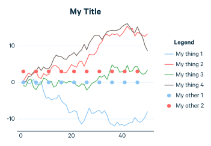
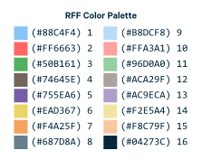

RFFMakie.jl
===========


[](https://www.gnu.org/licenses/gpl-3.0)
[](https://github.com/e4st-dev/RFFMakie.jl/actions?query=workflow%3ACI)
[](https://codecov.io/gh/e4st-dev/RFFMakie.jl)

Theming and color guidance for Resources for the Future comes from [here](https://media.rff.org/documents/RFFDigitalBrand-Guidelines.pdf).  This package exports `theme_rff` to be used with Makie using the `set_theme!` function.

# Installation
```julia
using Pkg
Pkg.add("RFFMakie")
```

# Usage

RFFMakie is a very simple package that re-exports Makie and CairoMakie (its publication quality backend).  RFFMakie defines colors and gives a theme called `theme_rff`.  To learn how to use Makie.jl, see the extensive [Makie documentation](https://docs.makie.org/stable/).

## Example Plot

```julia
using RFFMakie
# fig = example_plot()

set_theme!(theme_rff())
fig = Figure()
ax = fig[1,1] = Axis(f, title="My Title")
lines!(ax, 1:50, cumsum(randn(50)), label="My thing 1")
lines!(ax, 1:50, cumsum(randn(50)), label="My thing 2")
lines!(ax, 1:50, cumsum(randn(50)), label="My thing 3")
lines!(ax, 1:50, cumsum(randn(50)), label="My thing 4")
scatter!(ax, 1:5:50, zeros(length(1:5:50)), label="My other 1")
scatter!(ax, 1:5:50, 3*ones(length(1:5:50)), label="My other 2")
fig[1,2] = Legend(f, ax, "Legend")
save("example.svg", fig) # or .png or .pdf
```


# RFF Colors
```julia
rff_colors() # Returns a vector of all the themed colors
rff_colors(1) # Returns single color
rff_colors.([1,2,3,4]) # Returns a vector of each of those colors
```

